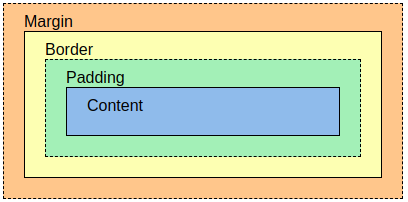

# Notes

## Mobile Native
Mobile Native section is aiming to align Android and iOS equivalent on all aspects.

### Title
#### iOS
#### Android

### UI
#### iOS
declarative ui
1. SnapKit
- https://github.com/SnapKit/SnapKit
- https://github.com/springwong/SnapKitten

2. Stevia
- https://github.com/freshOS/Stevia

3. SwiftUI (iOS 12+)
- https://developer.apple.com/xcode/swiftui

4. ComponentKit (Facebook)
- https://github.com/facebook/componentkit

#### Android
XML (preferred)

declarative ui
1. Compose UI
https://developer.android.com/jetpack/compose

### Depedency Injection
#### iOS
- Swinject (Swift) - lightweight, easy to use
https://github.com/Swinject/Swinject

#### Android
- Koin (Kotlin) - lightweight, easy to use
https://github.com/InsertKoinIO/koin

- Dagger (Java) - complex, official
https://github.com/google/dagger

### High Level Navigation
Abstract the navigation and make it easier to handle
#### iOS
- XCoordinator
https://github.com/quickbirdstudios/XCoordinator
#### Android
- Cicerone
https://github.com/terrakok/Cicerone

### Image Fetching
#### iOS
- Kingfisher
https://github.com/onevcat/Kingfisher
- SDWebImage
https://github.com/SDWebImage/SDWebImage
#### Android
- Glide
https://github.com/bumptech/glide
- Picasso
https://github.com/square/picasso
- Fresco
https://github.com/facebook/fresco

### API standard / http client
#### iOS
- Moya - Standardize API https://github.com/Moya/Moya
- Alamofire https://github.com/Alamofire/Alamofire

#### Android
- Retrofit - Standardize API https://github.com/square/retrofit
- okhttp https://github.com/square/okhttp
- okhttp logging interceptor https://github.com/square/okhttp/tree/master/okhttp-logging-interceptor
- okhttp profiler plugin https://github.com/itkacher/OkHttpProfiler

### Resource management
#### Both
- Twine, share resource with standard data structure https://github.com/scelis/twine

#### iOS
- R.swift https://github.com/mac-cain13/R.swift
- SwiftGen https://github.com/SwiftGen/SwiftGen

#### Android
native resource system should be enough

### Debugging
- Flipper https://fbflipper.com/docs/setup/network-plugin

#### iOS
- CocoaLumberjack (Logging) https://github.com/CocoaLumberjack/CocoaLumberjack
- NSLogger (Mac Desktop App) https://github.com/fpillet/NSLogger
- netfox (Network logging) https://github.com/kasketis/netfox
- FLEX (All-rounded but more injected) https://github.com/FLEXTool/FLEX
- AlamofireSafariLogger (Safari popup for networking logging) https://github.com/springwong/AlamofireSafariLogger

#### Android
- Logger (Logging) https://github.com/orhanobut/logger
- Stetho (Network logging) https://github.com/facebook/stetho
- Chunker (External Android Activity, release mode available) https://github.com/ChuckerTeam/chucker
- NSLogger (Mac Desktop App) https://github.com/fpillet/NSLogger
- Pandora (All-rounded but more injected) https://github.com/whataa/pandora

### Functional Reactive Programming
#### iOS
- RxSwift https://github.com/ReactiveX/RxSwift
- RxSwiftCommunity https://github.com/RxSwiftCommunity

#### Android
- RxJava https://github.com/ReactiveX/RxJava
- RxKotlin https://github.com/ReactiveX/RxKotlin
- RxRelay 2-way https://github.com/JakeWharton/RxRelay
- RxBinding https://github.com/JakeWharton/RxBinding

### Lint
#### iOS
- SwiftLint https://github.com/realm/SwiftLint
#### Android
- Ktlint https://github.com/pinterest/ktlint


### Hot reload
#### iOS
- InjectionIII https://github.com/johnno1962/InjectionIII
#### Android
- Exist in android studio

### Unit Test
#### iOS
- Slather https://github.com/SlatherOrg/slather
#### Android
- Local Unit Test
https://developer.android.com/training/testing/unit-testing/local-unit-tests.html
- Jacoco
https://github.com/arturdm/jacoco-android-gradle-plugin

### Data Model
- https://app.quicktype.io/

### Others
#### Charts
- iOS https://github.com/danielgindi/Charts
- Android https://github.com/PhilJay/MPAndroidChart

#### Lottie (Animation)
- iOS https://github.com/airbnb/lottie-ios
- Android https://github.com/airbnb/lottie-android
- React Native https://github.com/lottie-react-native/lottie-react-native

#### QR Code
- iOS https://github.com/zxing/zxing
- Android https://github.com/journeyapps/zxing-android-embedded

#### Lifecycle (Rx)
- iOS https://github.com/onmyway133/RxLifeCycle
- Android https://developer.android.com/jetpack/androidx/releases/lifecycle

#### Java8 API
- https://github.com/luontola/retrolambda
- https://github.com/stefan-zobel/streamsupport

#### Code conversion
- https://github.com/angelolloqui/SwiftKotlin

#### Command line tools
- iOS https://github.com/facebook/idb
- Android https://developer.android.com/studio/command-line/adb

### Mobile Security
- https://github.com/MobSF/Mobile-Security-Framework-MobSF

### Code Generation
- Java https://github.com/square/javapoet
- Kotlin https://github.com/square/kotlinpoet
- Swift https://github.com/krzysztofzablocki/Sourcery

### Memory Leak
- Android https://github.com/square/leakcanary

## React (.js / native)

### IDE

#### Code Styling
https://editorconfig.org/

#### Import Path
https://code.visualstudio.com/docs/languages/jsconfig

#### Visual Studio Code
https://code.visualstudio.com/

###### Shortcuts
1. Find file
CMD + P

2. Search text in file
CMD + F

3. Search text in workspace
CMD + SHIFT + F

4. Replace text in workspace
CMD + SHIFT + H

5. Vertical select
OPTION + SHIFT + SELECT 

###### Plugins
1. Numbered Bookmarks
2. Snippetes (React / Angular JS )
3. Paste JSON as Code
4. Prettier - Code formatter
5. Eslint
6. Debugger for chrome

### Debugging
1. Reactotron
https://github.com/infinitered/reactotron

#### Custom Command with parameters
```
import { ArgType } from "reactotron-core-client";

Reactotron.onCustomCommand({
  command: "Open Webview",
  handler: params => { 
    const path = params.path;
    // do something
  },
  title: "Open Webview", // This shows on the button
  args: [
    {
      name: "path",
      type: ArgType.String,
    },
  ],
})
```

2. Facebook Flipper (Default)
https://github.com/facebook/flipper

3. React DevTools
https://chrome.google.com/webstore/detail/react-developer-tools/fmkadmapgofadopljbjfkapdkoienihi

### UI Components
1. Storybook
https://github.com/storybookjs/storybook

### Networking / Caching
1. axios
https://github.com/axios/axios

2. React Query
https://react-query.tanstack.com/

### Testing
1. react cosmos
https://github.com/react-cosmos/react-cosmos

2. axe-core
https://github.com/dequelabs/axe-core-npm/tree/develop/packages/react

### State Management
1. Redux
https://github.com/reduxjs/react-redux

2. Mobx
https://github.com/mobxjs/mobx

3. Relay (GraphQL)
https://github.com/facebook/relay

#### Redux Side Effect Middleware
1. thunk
https://github.com/reduxjs/redux-thunk

2. Saga
https://github.com/redux-saga/redux-saga

3. Rx Observable
https://github.com/redux-observable/redux-observable

### React basic life cycle
1. componentDidMount
2. componentDidUpdate
3. componentWillUnmount

### React Hooks (modern UI without classes)
https://reactjs.org/docs/hooks-intro.html

#### useState
```
function App() {
    // count: reactiveValue
    // setCount: setter
    // 0 here is initial state;
    const [count, setCount] = useState(0);
    return (<div>count</div)>);
}
```

#### useEffect
```
function App() {
    useEffect(() => {
        // trigger as componentDidMount and componentDidUpdate
        alert('hello world')
        // return function trigger when componentWillUnmount
        return () => alert('componentWillUnmount');
    },
    // dependencies, run when array reactiveValue changes
    [])
}
```

#### useContext
Context is based on Context API which provide Content with Provider pattern

#### useRef
mutable value does not re-render UI.

#### useReducer
useReducer is for redux pattern
```
function App() {
    const [state, dispatch] = useReducer();
    return <>
        Count: {state},
        onPress: () => { dispatch({type: 'xxx', payload: {}})}
    </>
}
```

#### useMemo
cache result of function call, rare case to use
```
function App() {
    const [count] = useState(60);
    const expensiveCount = useMemo(() => {
        return count ** 2;
    }, [count])

    return <></>;
}
```

#### useCallback
useCallback to prevent unnecessary re-render
```
function App() {
    const [count] = useState(60);
    const callback = useCallback(() => {
        alert('123);
    }, [count])

    return <><button onPress={callback}></button></>;
}
```

#### useLayoutEffect
runs after the render but before painting to screen
blocks visual updates until your callback is finished

#### Functional Hook && useDebugValue
Instead of
```
function App() {
    const [count, setCount] = useState(0);
    useEffect(() => {
        alert(count)
    }, [])
    return (<div>count</div)>);
}
```
We can
```
function countFunc() {
    const [count, setCount] = useState(0);
    useEffect(() => {
        alert(count)
    }, [])
    useDebugValue(count ?? 'I am zero')
    return count;
}
function App() {
    const count = countFunc();
    return (<div>count</div)>);
}
```

### Foundation Packages
1. URL https://nodejs.org/api/url.html
2. Lodash https://lodash.com/
```
import _ from "lodash";
```
3. React Native Community https://github.com/react-native-community
4. moment https://momentjs.com/
5. Crypto JS https://github.com/brix/crypto-js
6. JWT decode https://github.com/auth0
7. Query String https://nodejs.org/api/querystring.html

## Node.js / JavaScript

### Code Formatting (JavaScript, HTML, CSS, GraphQL, Markdown, YAML)
https://prettier.io/
```
{
  "trailingComma": "es5",
  "tabWidth": 4,
  "semi": false,
  "singleQuote": true
}
```

### Package scan
1. Bundle size
https://bundlephobia.com/

### Debugging

https://nodejs.org/en/docs/guides/debugging-getting-started/

```
// simple one, listen on 127.0.0.1:9229
node --inspect index.js

// Break before code starts
node --inspect-brk index.js

// listen on other ports
node --inspect=[host:port] index.js

// Chrome inspector, in chrome url, open:
chrome://inspect

// Visual Studio Code, start debug mode
Terminal > DropDown > 'Create Javascript Debug Terminal'
```

## CSS

### CSS Preprocessor
PostCSS
https://postcss.org/

Sass
https://sass-lang.com/

Stylus
https://stylus-lang.com/

Less
https://lesscss.org/

### Box Model


### Flex Box
Single  Columns/rows
```
.flex {
    display: flex;
    justify-content: center;
    align-items: center;
}
```

### Grid
multiple columns/rows
```
.grid {
    display: grid;
    grid-template-columns: 1fr 500px 1fr;
    grid-template-rows: 100px 200px;
    place-items: center;
}
```

### Responsive Layout
Simple way
```
.size {
    width: 50%;
}

@media only screen and (max-width:600px) {
    .size {
        width: 200px;
    }
}

@media only screen and (min-width: 1200px) {
    .size {
        width: 800px;
    }
}
```

Advance way:
```
.size {
    width: clamp(200px, 50%, 600px);
}
```

### Ratio
```
.ratio {
    width: 100%;
    aspect-ratio: 16/9;
}
```

### CSS Variables
```
// :root is global scope of variables. To use local scope, declare it inside the selector.
:root {
    --text-color: rgb(255, 0, 0);
    --r: 128;
    --g: 0;
    --b: 0;
    --another-color: rgb(var(--r), var(--g), var(--b));
}

p {
    color: var(--text-color);
}

// override text-color in local scope
h1 {
    --text-color: rgb(0, 0, 0);
    color: var(--text-color);
}

h2 {
    color: var(--another-color);
}
```

### calculation values
```
width: calc(100vm - 80px);
font-size: calc(1rem * 1.25);
padding: calc(5% + 2px);

// calc X variables to achieve smooth delay
.order {
    animation-delay: calc(var(--order) * 100ms);
}
<i class="drop" style="--order: 1">1</i>
<i class="drop" style="--order: 2">2</i>
<i class="drop" style="--order: 3">3</i>
```

### CSS Counter (State)
```
:root {
    counter-reset: headings;
}

h1 {
    counter-increment: headings;
}

h1::before {
    content: counter(headings);
}
```

### Focus control
```
button:foucs-within .dropdown {
    opacity: 1;
    visibility: visible;
}
```

### CSS Units
```
// Fixed units
h1 {
    font-size: 14px;
}

// Relative units, em / rem
// em relative to parent's font size
// if parent font size is 12px, 2em = 12px * 2 = 24px
// rem relaive to root font size
h1 {
    font-size: 1em;
    padding: 1rem;
}

// character width, ch, definition of character here is width of "0"
// in this example, width is from minimum 45 characters to 75 characters
.card {
    width: clamp(45ch, 50%, 75ch);
}

// relative to viewport, vw / vh, unit is x% of viewport width / height
// vmin / vmax is relative to 1% of viewport's smaller / larger dimension
h1 {
    font-size: 20vw;
}

```

### CSS color format
1. rgb
rgb(255, 0, 0)

2. hsl
hsl(0, 35%, 50%)

### Scroll
```
article {
    scroll-padding: 1rem 0 0 0;
}
```

### Future
content-visibility
https://developer.mozilla.org/en-US/docs/Web/CSS/content-visibility

### Performance
1. multiple css for media
```
<!-- style.css contains only the minimal styles needed for the page rendering -->
<link rel="stylesheet" href="styles.css" media="all" />
<!-- Following stylesheets have only the styles necessary for the form factor -->
<link rel="stylesheet" href="sm.css" media="(min-width: 20em)" /><link rel="stylesheet" href="md.css" media="(min-width: 64em)" /><link rel="stylesheet" href="lg.css" media="(min-width: 90em)" /><link rel="stylesheet" href="ex.css" media="(min-width: 120em)" /><link rel="stylesheet" href="print.css" media="print" />
```

2. Parallel / in-series call on css files


## API

### API Clients

#### Postman
[Postman Detail](./README.postman.md)

#### Insonomia

#### PAW

### API Documentation
https://swagger.io/

### Proxy

#### Charles Proxy
https://www.charlesproxy.com/

Free, easy to integrate with iOS and Android.
mock data available.

#### Fiddler
https://www.telerik.com/fiddler

#### Wireshark
https://www.wireshark.org/

#### Proxyman
https://proxyman.io/

## DevOps
1. Web / API Deployment
- OpenShift (Docker)
https://www.openshift.com/

2. Mobile Deployment
- Azure DevOps
https://docs.microsoft.com/en-us/azure/devops/?view=azure-devops

### Pipeline
- Mac agent support
- .yaml: to control the steps
- secure files: store certificate / keystore
- variable group: to store values whiic are private / public to devs
- built binary is stored in Artifact

### Release
- Trigger by artifact build
- tasks to take action on artifact, i.e. upload testflight, appcenter
- Approver can be invovled between tasks
- Service connection to setup account information

Fastlane
https://fastlane.tools/

## Useful tools

### Diagram

#### General Diagram
- https://www.lucidchart.com/
- https://www.gliffy.com/

#### Sequence Diagram
- https://sequencediagram.org/

#### Cloud diagram
- https://www.cloudcraft.co/
- https://www.hava.io/

### Online Complier
#### JS
- https://jsbin.com/?html

#### Website Scanning
- https://www.ssllabs.com/ssltest/

### UIUX Prototype
- https://app.zeplin.io/projects
- https://overflow.io/
- https://www.invisionapp.com/
- https://www.figma.com/

### Design
#### Font Review on design
- https://fontflipper.com/upload
#### Firebug for designers
- https://github.com/GoogleChromeLabs/ProjectVisBug

### Data Model
- https://app.quicktype.io/

### Git ignore file
- https://www.toptal.com/developers/gitignore